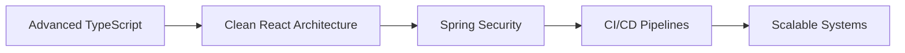

<!-- ELITE GitHub Profile README | Timsheldon Oure -->

<div align="center">

# Timsheldon Oure 👋

### Frontend-Focused Full Stack Engineer

Building modern, scalable, and user-first web applications.


<br />

<a href="mailto:timsheldonoure1@gmail.com">
  
</a>
<a href="https://linkedin.com/in/timsheldon-oure">
  
</a>

</div>

---

## 🧠 About Me

```ts
const timsheldon = {
  role: "Frontend-Focused Full Stack Engineer",
  builds: "Production-ready web apps",
  strength: "Turning complex ideas into clean UI",
  mindset: "Think product, not just code",
  currentFocus: [
    "Scalable React architecture",
    "Secure Spring Boot APIs",
    "Performance optimization"
  ]
};
```

I design and build applications that are not just functional, but intuitive, scalable, and aligned with real-world use.

---

## 🚀 Featured Projects

### 🛍️ E-Commerce Platform

Full-stack responsive application

* React + Tailwind frontend
* Spring Boot backend
* JWT authentication
* Scalable REST APIs
* Mobile-first UI

👉 [Add your live link here](https://thebushcollection.africa/)
👉 Add your repo link here

---

### 🏥 Medical Dashboard (Tech Care)

Data-driven UI for patient monitoring

* Chart.js data visualization
* Dynamic API integration
* Clean dashboard UX
* Real-time vitals representation

👉 [Add your live link here](https://patientdatadashboard.netlify.app/)
👉 Add your repo link here

---

## 🧩 What Makes Me Different

* I build **user-focused interfaces**, not just components
* I think in **systems and scalability**, not just features
* I combine **frontend polish with backend logic**
* I prioritize **clarity, usability, and performance**

---

## 🛠 Core Stack

### Frontend

React · TypeScript · Tailwind CSS · Next.js

### Backend

Django· REST APIs · JWT Auth

### Database

MySQL · MongoDB · Supabase

### Tools

Git · Docker · Vercel · Netlify

---

## 📊 GitHub Analytics

<div align="center">


<br />


</div>

---

## 📈 Activity Graph

<div align="center">


</div>

---

## 🎯 Current Growth Focus



---

## 🤝 Let’s Build

I’m open to collaborating on projects that:

* Solve real-world problems
* Improve user experience
* Scale beyond MVP level

<div align="center">

### Clean UI. Strong Logic. Real Impact.

<a href="mailto:timsheldonoure1@gmail.com">
  
</a>

</div>
